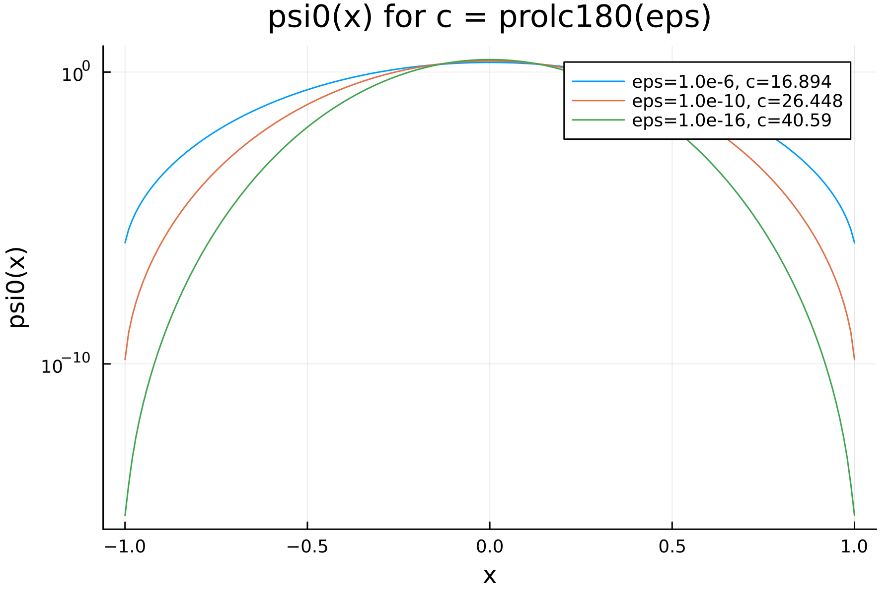
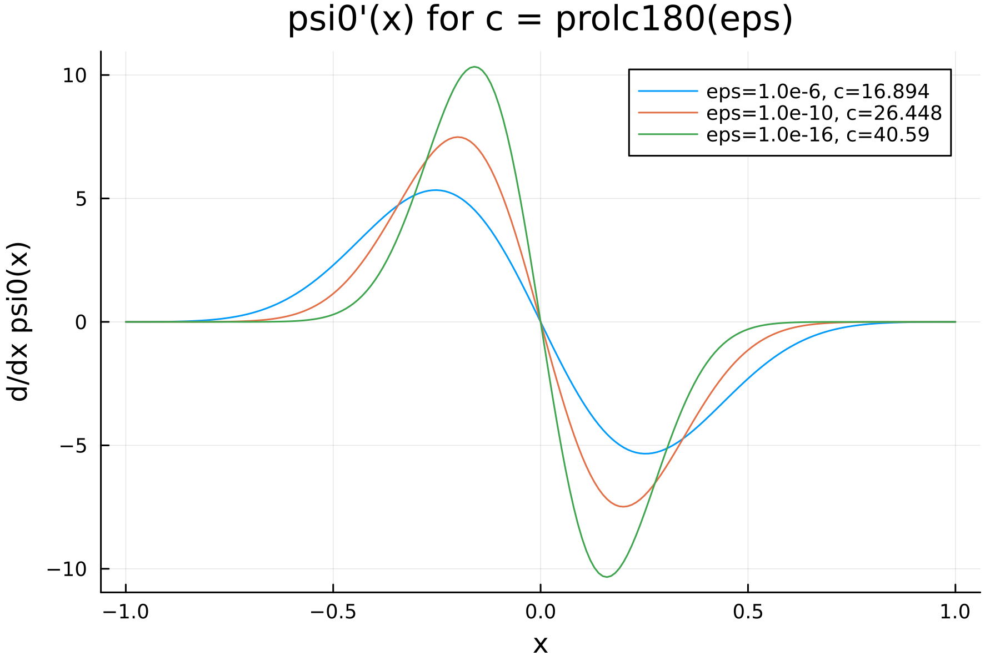

# ProlateSpheroidal.jl

Native Julia implementation of the 0th order prolate spheroidal wave function (PSWF) with helpers for evaluation, derivatives, integrals, and eigenvalue computation. The implementation is a translation of the C++ reference (by Shidong @sj90101 and Libin @lu1and10) and ships pre-generated test fixtures so tests do not depend on the C library.

## Plots

The examples in `example/` generate the figures below (see `example/figs`).





## Install

In the Julia REPL:

```julia
using Pkg
Pkg.add(url="https://github.com/ArrogantGao/ProlateSpheroidal.jl")
```

## Usage

```julia
using ProlateSpheroidal

# Pick an eps and compute c
c = prolc180(1e-10)
params = Prolate0Params(c)

# Evaluate psi0 and its derivative
val = params(0.25)
ber = prolate0_eval_derivative(params, 0.25)

# Integrate psi0 from 0 to r
int_val = prolate0_int_eval(params, 0.5)

# Compute lambda
lambda = prolate0_lambda(params)
```

You can also call the convenience methods directly (they create parameters internally):

```julia
val = prolate0_eval(5.0, 0.25)
```

## Examples

Generate plots for several eps values:

```bash
julia --project -e 'using Pkg; Pkg.add("Plots")'
julia --project example/eps_plots.jl
```

Outputs:
- `example/figs/psi0_eval.png`
- `example/figs/psi0_derivative.png`

## Testing

Tests compare the Julia implementation against pre-generated reference values:

```bash
julia --project -e 'using Pkg; Pkg.test()'
```

To regenerate the reference fixture from the C++ library (optional):

```bash
julia --project test/fixtures/generate_reference.jl
```

## API

- `prolc180(eps)` -> c parameter from eps
- `prolc180_der3(eps)` -> derivative helper table value
- `Prolate0Params(c; lenw=10000, quad_npts=200, int_npts=200)` -> precomputed parameters
- `prolate0_eval(params, x)` or `params(x)` -> psi0(x)
- `prolate0_eval_derivative(params, x)` -> derivative of psi0
- `prolate0_int_eval(params, r)` -> integral from 0 to r
- `prolate0_lambda(params)` -> lambda value

## Layout

- `src/tables.jl` -> lookup tables for `prolc180` and `prolc180_der3`
- `src/helpers.jl` -> Legendre and quadrature utilities
- `src/prolate0.jl` -> PSWF core implementation
- `test/fixtures/pswf_reference.jl` -> pre-generated reference values
